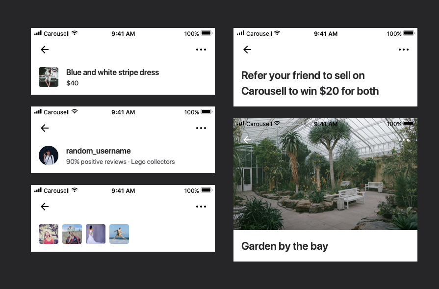

## Overview

Carousell is the largest and fastest growing consumer-to-consumer marketplace in South East Asia. As of Sep 2019, 70 million transactions happened on the online marketplace, buying and selling every day objects, such as clothes, electronic gadgets, furnitures, as well as properties, cars, and so on.

Communication between buyer and seller is a core part of Carousell, the largest second-hand marketplace in South East Asia. In the application, buyer initiated conversation with seller on the listed item to show interest of buying. If the item, price, and ways to deal work out for both sides, they commit to the agreed deal and proceed to transaction.

When Carousell started in 2012, chatting in Carousell to get a good deal felt magical. By 2017, the magic faded in comparison with fast and reliable communication made possible by messaging applications people use daily to connect with family and friends.

In 2017, my team integrated a third party messaging service to upgraded Carousell's communication experience to real-time. In 2019, with Carousell's new branding and new styles, I refreshed the interface to be modern and universal. Later in 2019, we re-iterated Carousell Chat to be seamless in unstable internet and made the service more stable and bug-free. Monthly active user for Chat was increased by 6.5x.

After my team (then Growth team) worked on the real-time chat experience, I worked with product manager Huiyi Chia as the owners of Carousell Chat while working on Community and Monetisation in 2018 and early 2019.

I was responsible for user research, competitor analysis, ideation, UX and UI, prototyping, user testing, technical discussion, after-launch user research, and so on.

Let's get into the process of each phase of this journey perfecting chat experience for Carousell.

## Phase 1: Real-time chat (2017Q4)

### UX Challenge

When Carousell started in 2012, the communication in app was a commenting system. It was superior to the alternatives to buy and sell second-hand items from strangers back then, such as Gumtree or newspaper. People loved the idea to chat to get good deals. Thus, one out of four people in Singapore use Carousell and Carousell expanded to 6 countries in South East Asia and Australia.

In the next few years, real-time chat became the norm and was taken for granted in South East Asia. Since communication in Carousell application was not real-time, users could not get the messages right away. With the constant need to refresh the page to see latest replies and the doubts whether the other person is still interested in the deal, the transaction often fall apart because the interest in the transaction diminishes due to inconvenient communication. Many people connected on Carousell and moved the conversation to messaging apps they use daily, leaving Carousell out of the conversation.

### Business Challenge

**We started this project because we aimed to win Malaysia in 2018**

Carousell was focusing on winning Malaysia at the moment. However, users fail to transact on Carousell because the communication channel did not help to facilitate the successful transactions. Hence they brought the chats to another platform. This resulted in a broken Carousell experience, and the reduced possibility of completing a transaction on Carousell.

Users in Malaysia were facing frauds and scams. When the communication is brought off the platform. Carousell had no way to prevent frauds and scams and investigate into the cases.

**Providing more value to our community in the long run**

Carousell wants to keep the communications among buyers and sellers in Carousell to provide more values to our community.

When the communications and transactions happen in the applications, we can build a trustworthy marketplace with the reviews from the transactions. Sellers build up their reputation when they sell items as described, being nice and accommodating. Buyers show they are genuine when they show up to the meetups on time or follow through the transactions as they promised. Carousell helps to keep personal details private for both sides as well.

We can improve the experience to facilitate transactions, such as matching buyers with items they might be interested in or provide pricing suggestions to sellers. These are all possible when Carousell facilitates the transactions. With any improvements, we could learn if the solution help people to reach transaction.

As the facilitator, Carousell detects fraudsters by monitoring suspicious and risky behavior. Our marketplace operations team assist in cases of disputes and help our users investigate into the issue.

### Goal

Our goal in the project is to build communication tools that helps users reach to fast and successful transactions.

It is crucial for the experience and therefore, the business.

### Exploring the problem

We formed the assumption that the communication in the application was one of the reason people failed to transact with one another. We wanted to verify that it was indeed a problem and was big enough for us to invest our effort to solve it.

We started with sampling 200 conversations between buyers and sellers to understand why sellers received offers but not making a sale. More than 50% of the conversations did not lead to transactions due to flawed communication tool in the application.

To understand the exact problems in the in-app communication tool.

- we talked to our community in 1-1 user interviews and user meetups in Malaysia, Singapore, Indonesia, and Taiwan to gather qualitative insights that bring the quantitative insights to life.
- we conducted survey with users who have the behaviour to bring chats to Whatsapp to understand why they do so.
- we conducted survey with users who prefer using Carousell Chat to understand the strengths of our existing features.

From the insights gathered in user interview and survey results, we gathered a few problems in detail.

**Problem 1: Buyers could not get replies as soon as they want so they moved on to other sellers or other platforms to buy the item.**

> When will the seller get back to me?

Carousell is slow and is not real-time. People are not responsive in Carousell Chat.

Sellers want to be responsive to the buyers to close the deal while they are still interested. However, it's time consuming to check in Carousell Chat whether buyers have replied to you and therefore seller is either not responsive or being anxious refreshing the chat page to stay responsive.

> I don't want to waste my time messaging the seller and never get a reply. Some sellers don't use Carousell anymore. I go check the seller profile to see when they list the latest item to get a sense if they are still active on Carousell.

Buyers want the sellers to respond to their enquiries so they know if the item is available, suitable, and convenient for them to get it. Buyers don't know if the seller is still using Carousell and would they ever replied to the enquiries.

**Problem 2: Sellers are not sure if buyers are engaged in the communication / genuine in the deals**

> Is the buyer serious in continuing the deal?

Knowing whether the other person is engaged in the deal is an important signal whether the other person is still interested and would keep their side of the promise.

**Problem 3: Miscommunication happened due to seeing the messages later.**

Could not find each other at the place of meetup. Received payment but did not confirm with the buyer.

> "Messages are slow and not real-time. I have to go out from a chat and come in again to get it refreshed."

With the commenting system, we need to rely on users to refresh the app or page to refresh the chats. That means, even when you are in Carousell app or you are in Inbox page, or inside the chat with the buyer, if you do not refresh, you don't know there is a new message. Similarly, we won't be able refresh the updates count on the app icon in real time.

People who have more experience dealing on Carousell prefer bringing conversations to Whatsapp or other messaging apps, citing that "_it’s easier to message"_ and "_it's faster on Whatsapp_". 26% of the chats were brought to whatsapp. We could not conclude whether the there is deal. One of the seller said that _"If the buyer is willing to give whatsapp contacts, he is more serious buyer."_

**Problem 4: Missed notifications and difficulty sending photos to buyers.**

People had problems receiving notifications from Carousell. This is a technical problem on how stable and universal our push notification system was. Also, there was issue in the flow when Carousell asks users for permission to send push notifications.

It's difficult to send photos to buyers to show them details of the products. It takes 6 steps or more to send out one photo. The photo had to be cropped to square due to our system limitation back then.

We did not tackle these two problems in this iteration because we think there are still workarounds for these two problems in Carousell Chat.

---

To summarize, with the current in-app communication tools, users could not receive and reply messages as soon as they'd like. They were frustrated and anxious when communicating with one another and they could not get information to manage their expectation.

### Solve

From user research and business analysis, we reached to conclusion that we need to provide real-time communication and help people to manage their expectation of when the other person might reply and get a sense if they are still engaged in the deal.

We were given three months. It was in such a tight schedule because we really needed to win Malaysia. To solve the problems in Carousell's current communication system, we decided to work on these four stories.

1. As a user, I want to see the latest messages from the other person right away.

   This is the biggest problem. If we solve this problem, we will also be able to show that there are new messages in any page of the app and outside of the app. As a seller, this is very helpful for me to know I have new messages to attend to. As a buyer, I know my questions are being answered.

2. As a user, I want to know how active the other person is on Carousell.

   This helps the buyer to know whether to even message the person and if they do, in how long can they expect a reply.

3. As a user, I want to know if the other person has read my message.

   This shows how genuine people are in the conversation. You know a lot if you know that they have not even read your message or they did but decided not to reply.

4. [Optional] As a user, I want to know if the other person is sending new messages to me.

   This helps to facilitate the fastest replies and one step closer to face-to-face conversation. When the other person is typing a message to you, it means they are active in your conversation.

The engineering side to enable these are challenging due to dependencies across different user journeys. While backend engineers and infrastructure team discussed pros and cons of building real-time chat in-house or leveraging a third party messaging service, I started working on the wireframes to help everyone be on the same page. So we all know what we are trying to build in the business and engineering discussions.

In this project, my main goal was to find the minimal ways for us to implement real-time chat experience given tech limitations. After understanding the current implementation, I proposed the design below.

### **Feature-based user interviews and usability test**

I went on to build interactive prototypes and conducted user testing, so we don't waste time building anything that does not justify the impact. Each user testing session was about 30 minutes. I tested the prototype with 5 Carousell users in Singapore.

Participants understood what Carousell tries to do right away with the prototype in their hands seeing messages coming in without refreshing the application and the grey and blue ticks in each message they sent.

Most participants were excited that Carousell was finally doing real-time chat. Some of them have wrote in before the session complaining about the in-app chat systems and how missing important messages costed them the chance to close the deal.

Two insights from the user testing sessions helped me to simplify inbox experience.

**Last active time**

> "To me, active now and active 3 minutes ago don't make much differences."

I had the idea to indicate that a user is online now in inbox. The intent was to show that "this person is online now and can attend to your messages sooner."

In user testing sessions, however, two participants pointed out that they don't really care if someone in their inbox list is active right now as they don't just message them because someone is online.

Knowing when the person recently uses Carousell allow users to gudge how active the person is. But it's not that important to know they are online at the moment as they might be online but attend to something else on Carousell.

**Typing indicator**

> "If she is typing, I will stay in the chat a bit longer so I can see the message and reply right away. If I am not in the chat, I just wait for her to actually send out the message."

The fact that the other person is typing only matters when the user is in the conversation. It's not as important to show a user is typing in inbox.

I was glad that we removed these two information from Inbox, allowing users to focus on the important things, such as new messages coming in that they haven't attended to.

**"Active now"**

In the chat screen, one participant showed confusion on the phrase "Active".

> "What does active mean? Is it that they are in this chat now?"

I asked her what she thinks it is. She said "active now" is either the person is in the app now or in this chat now. She couldn't be sure.

After discussing with the team, we decided to go with "online" instead of "active". With the intended implementation, we only knew that the person is in the application. "Online" is more objective, meaning the person is on Carousell now. "Active" signals that the person is actively doing something and this might backfire when the person is "online" but not actively replying messages.

### Final mocks

### Impact

We launched new Carousell Chat in December 2017.

Buyer and seller can communicate in real-time, and gauge how engaged the other person is in a conversation.

It's hard for us to conclude the impact of real-time chat in a few months time. It takes some time for people to trust the new chat and unlearn the habits to bring chats off the platform. However, there are two things we observed that told us we did the right thing.

1. People wrote in to complain about online status and read receipts. They don't want their buyers know that they chose not to reply their messages. This is good because that's exactly what we want to help the community for. We want to urge people to be more responsive and know that the other person is not engaged in the conversation as much.

2. After the launch, we had some issues on the technical side from time to time. We had to turn off real-time chat and fall back to the old commenting system so at least users can still connect to each other. Whenever that happens, we received overwhelming tickets, messages, and one-star app store reviews, complaining that we rolled back the real-time chat.

### Learnings

1. We tested with Singapore users due to convenience as we were in tight schedule. However, after we rolled out the feature to the community, we saw many support tickets from Philippines users about the meaning of blue ticks. It is a pattern Whatsapp introduced and Singaporeans have no problem understanding it because they are familiar with Whatsapp. Back then, Viber is the most popular messaging app in Philippines.
2. We planned to include an option for user to decide if they want to show their online status to other users. If they hide their online status, they won't be able to see others' online status either. Not showing online status can keep their Carousell activities private, but might lead other users perceive these users as less engaged in the deals.

   To launch real-time chat faster, we planned to use the next sprint to launch this feature and we have planned and estimated the feature. However, there were other priorities after the launch and we shifted our focus to work on more important things. My lesson learned is if I believe that a feature has to be delivered together to create the experience that user loves and trusts and of the value I want to champion for, I should have fought it to be included.

# 2. Brand alignment (2019 Q3)

During Carousell’s rebranding exercise, I refreshed the look of chat experience to reflect the new brand identity of Carousell.

New brand positions of Carousell

### Visual design

**Introduce neutral color header bar**

We used to be able to recognise Carousell users by the signature red navigation bar on the phone and couldn't help but observe how they use the app. With the rebranding project, we re-imagine the red branding in the application.

I initiated the project for new header bar with neutral color across the application so we can refocus on the content and accomodate more possibility for header, such as rich media and loud and clear text title in trend.

**Improve contrast and enlarge text size for readability**

I picked dark blue and light grey for messages on top of white background for contrast. Dark blue creates a calm environment for conversations, aiming to facilitate trustworthy and reliable transactions.

**Scalable chat action bar**

The actions available in each chat are different depending on the transaction progress and the role of the current user. With the previous design, the layout could easily be broken on small screens depending on available actions and localised action text.

I took the chance to redesign the actions in chat to be more scalable in different cases and highlight the more primary action.

.png>)

**Update read receipts to universal seen indicator**

I updated our message state indicator to be more universal. Instead of grey and blue ticks that were not self-explanatory, "Sent" and "Seen" are universal and can be localised to reflect the status. We purposefully chose "Seen" instead of "Read" due to confusion caused by irregular verb tenses. We also updated the feature to be "seen indicator" internally to avoid confusion.

I took the chance to review all components and document all the use cases and scenario. Below are some of the specifications and documents I delivered to engineers to make sure we cover all the cases and functionalities integrated by other teams during this rebranding exercise and in the future.

### Learnings

Aiming to build a better experience, I worked with passionate engineers for more than changes considered styling changes but was essential for usability. By doing more, I jeopardize other commitments engineers have. Also, we didn't have proper A/B test or data tracking on user behavior before and after rebranding. Therefore, any changes that is not strictly styling changes, are not being monitored.

In retrospective, we should have fought for more time properly allocated to the project or acknowledge that we might deliver product with usability issues and risk user experience in short-term.

# 3. Offline experience improvement (2019 Q4)

While more users use Carousell on the go, they face mobile connectivity issue that amplify problems in Carousell chat. As a result, we found users frustrated and they might lose opportunities to close transactions in time.

Inspired by a panel from [Offline First community](http://offlinefirst.org/) in SXSW 2017, I was aware of that most of Carousell's user journey was designed for always connected world. So I started advocating for offline first. Since then, I had been working with product managers to uncover relevant user problems and discuss improvements that can provide better chat experience for unstable internet.

In late 2018, with web team's efforts to retire previous web framework to achieve better user experience, web team was rebuilding the chat system from scratch. We took the chance to propose and advocated for better chat experience and got the web team onboard to build it.

During implementation of the progressive web app, we made the business case and form a team to re-iterate on chat experience, for web and native apps. As part of chat improvements, we worked on improving offline experience for mobile applications and launched the new chat experience together with Progressive Web App.

### **Business problem**

Mobile connectivity issues were common in many parts of South East Asia, such as Philippines, Indonesia, and Malaysia. Since Carousell was competing in these countries, it's important to provide delightful experiences despite unstable internet.

With frustrating experience communicating on Carousell, users delay the communication until they can control the experience (when internet is stable) and miss the timing to close the transactions.

### Exploring the problem

While working on other important missions for Carousell, my product manager and I continue monitoring the problems and opportunities of in-app chat features. We collaborated with other teams on chat related improvements such as smart replies powered by machine learning.

We worked with customer support team to monitor user feedbacks, bug reports, and feature requests. And we slipped in questions about in-app communication in user research for community and monetisation topics and our weekly general interview with users. We discovered many issues in the chat experience, especially in the case when users are on unstable internet.

.png>)

The screen is blocked while sending a message.

.png>)

A toast is displayed if the system failed to send the message.

**Problem 1: Users cannot do things they want while sending a message**

In the chat thread, we only show messages that are sent and visible to the other person. When a message is being sent, the chat window is blocked for typing the next message or checking previous message. When a message couldn't be sent due to internet issue or system problems, the error message is shown as a toast.

> I have to pause and wait for my previous sentence to be sent.

- Have to wait for one message to send out successfully to type a second message
- Have to retype the message to send it again if the first one failed to send
- Feedbacks interrupts users' actions

**Problem 2: When user is on unstable internet, it's frustrating to resend messages.**

We want buyer and seller to be responsive so they can close the deal while they are interested in the deal. We don't want users to feel painful when internet is unstable and wait only until they have the best internet. They might forget to reply after the moment.

### Goal

Our vision of communication on Carousell is to facilitate people to have human-to-human communication, to be most natural while talking to one another.

In this iteration, we want to improve people's experience communicating with one another on unstable internet connection. To do that, we believe three things are important.

- Allow users to do things they want despite unstable connection
- Keep the users informed of the results of actions taken
- Complete the actions when users are reconnected or allow users to trigger the actions when reconnected.

### Solve

Since we wanted to let users do what they want while the messages are being sent, we need to have a a way to indicate the state of the messages within the flow. Naturally, we came up with the solution to include messages of different states, sending or failed, and indicating the states of messages. Previously, there was no need to indicate different states as all the messages in the thread are sent

We were not the first one doing this. There are many messaging app with different approaches that includes messages of different states in the lifecycle. I researched into different approaches and weigh and pros and cons of each. Finally I took the elements that works for Carousell's context, existing user interface structure, and technical limitations, and proposed the new UI for Carousell Chat.

Specification of UI for each status of message lifecycle

**New Message Thread includes messages of different state**

The solution I proposed included "sending" and "failed to send" messages in the thread, allowing users to send several messages in a row. They can view the progress of messages being sent without interrupting other things they want to do, such as checking the listed price or profile of the person they are talking to. If the messages could not be sent, they can take actions on it, to either resend it or remove the message if it does not apply to the situation anymore.

**New message timestamp UI**

I re-designed the message UI to include timestamps and state. To avoid repeating the same information, timestamp and state is revealed on tap of the message. Avatar of the other user is shown to indicate the messages was seen by the other user, inspired by Facebook Messenger.

**Resend messages after they were failed**

If the system failed to send out a message, user can resend the message or remove the message. User can hold the failed message to see the options to resend or remove.

This might looked like straightforward improvements on the surface as all the changes are on the same page. However, there were so many scenario and edge cases to be considered. Many trade-offs were made and documented after discussing intensively with engineers.

### Testing with Interactive Prototype

For highly interactive features such as Chat, I found it difficult to test with static prototypes where I need to help the tester to understand what happened. Therefore, I used Framer as the prototyping tool to build a prototype that is similar to the real app. With a bit of coding, Framer allowed me to simulate the other person's behavior, such as reading more messages at random timing, or simulating the internet going on and off. As a result, I just handed the prototype to the user and give them general goal, such as setting up meetup timing with the seller. After they play with the new UI, I then ask about their thoughts and any confusions of the chat experience.

[images/Sending**Retry_failed**Remove_failed_msg.mov](images/Sending__Retry_failed__Remove_failed_msg.mov)

I recruited users by posting a listing on Carousell marketplace and bring users who are interested to a screening survey.

I had testing sessions with 5 Carousell users in 2 days. Above is recording of the typical flow user will go through with the interactive prototype. All users understand immediately that messages that are being sent and messages that the system fail to send are now in the messages thread and they like this change. However, users don't get the seen indicator - the avatar. Avatar is not universal.

Before the testing session, I assumed users would understand the meaning of the avatar among messages as soon as they see the avatar moving down to below next message(s). In reality, users were not sure what the avatar mean after playing with the prototype. 2 users "guessed" that indicates the messages above the avatar were seen by the other user. 2 other users have no idea what the avatar means.

In retrospective, I concluded that the avatar as seen indicator works for Facebook Messenger because Facebook users mostly show their face or identity in Facebook profile photo. However, on Carousell, many people avoid revealing their identity and use photo that doesn't seem like a user avatar, such as nature, plant, or a photo related to their products. Therefore, it's difficult for Carousell users to relate the small avatar among the messages to a symbol of the person they are talking to.

To make it more universal and easy for even first time user to understand, we changed the seen indicator from the avatar to text "seen", showing the last seen message's timestamp and status.

We use this approach for last sent message in the thread as well. We utilize message timestamp and status we planned to build. The message timestamp and status are displayed when the message is the last one in the thread that is seen or the last one in the thread that is sent. Timestamp and status of other messages in the thread are hidden to avoid repetition and save space, while users can tap to reveal the information of each message.

With the minimal UI for messages that are being sent, this approach shows clearly if a message is sent or not.

.png>)

### Iterating on technical implementation to ensure user experience

This might looked like straightforward improvements on the surface as all the changes are on the same page. However, there were so many scenario and edge cases to be considered. Many trade-offs were made and documented after discussing intensively with engineers.

One topic as an example was the order of messages. It was simple time when all messages are sent and are ordered by the timestamp registered on backend side. Now we have messages of different status and those messages that are "sending" or "failed" are only on the client side. We need a way to stitch them together and display them in an order that is reliable and makes sense to the users.

I had the same goal as the client engineers, simplifying the implementation. We do not want to have too much engineering on the client side that takes too much computation power, data, and battery power. In the end, it all come back to users' expense.

We discussed three different approaches.

**Approach 1 - One List.**

W**e show messages in the order of timestamp, despite the status of the messages.**

We use client side timestamp for "sending" and "failed" messages, meaning when user tries to send it the first time. Once the message is successfully sent, we use the backend timestamp for the message because we do not want to maintain huge list of sent messages on client side.

While this approach has its benefit for users as it maintain the sequence users intended and it's easy to see latest messages, it's complex to maintain the order and the order might change inevitably due to contradiction of the timing user send the message and the actual timing that the message is registered on backend side.

- Check out examples if you are interested of the contradictions.
  1. While user sends message A and then sends message B, message B could be successfully sent before message A. This breaks the sequence users intended. If the position is maintained at the original position (A then B), it contradicts with what the other user see and might cause confusion between two users.
  2. When user successfully resent a previously failed message, if the position of the message is updated based on the successful timing, it is not maintained based on users' intent. If the position is maintained at the original position, it contradicts with what the other user see and might cause confusion between two users.

We ruled out this approach in early discussion.

**Approach 2 - Two List: (Sent) + (Failed + Sending)**

We show a list of sent messages (provided by backend) and then a list of "failed" and "sending" messages (maintained by client).

This is a clean cut between two different sources and we only need to maintain the order inside the list.

The list of sent messages is the same as the current app, where all messages are sent and they are displayed in the order of the timing registered on backend.

We use client side timestamp to maintain sequence among "failed" messages and among "sending" messages respectively.

Client engineers all prefer this approach to the first approach as this provides a clear structure for both users and engineers. We don't have contradictions of timestamps and order.

However, there is an interesting discussion raised by our iOS engineer. "For every message is successfully sent, it is first inserted to the Sending list, and then promoted to the Sent list. Given that most messages will be sent successfully, this approach takes double effort for most messages."

That's how we arrive to the third and our final approach.

**Approach 3 - Two List: (Sent + Sending) + (Failed)**

We show a list of sent messages (provided by backend) plus "sending" messages (maintained by client), and then a list of "failed" messages (maintained by client).

This is a variation from Approach 2 where we move the "sending" messages up. With this change, all successfully sent messages are inserted once, to the (Sent + Sending) list. Only in rare cases when a message could not be sent, it will be removed from the (Sent + Sending) list and insert in the (Failed) list.

With this approach, we assume the optimistic result so we don't have to move a message twice. This cut down many unnecessary operations on client side.

With these challenging conversations with engineers, we can comprehensively weigh our approaches to implement the design and be involved in making decisions to achieve the goal. In the end, engineering complexity translates to costs of user experience as well.

### Final design

[images/sending_staged.mp4](images/sending_staged.mp4)

We launched this iteration of chat experience in Q4 2019.

For features like chat, it's difficult to quantify the impact as the many factors affect communication and transaction between two users. We continue monitoring user feedbacks, App Store / Play Store reviews, and NPS score. In early 2020, we observed that we have less support tickets related to chat and users are really happy with the improvements we made.

### Learnings

We initiated this iteration for countries with less established internet infrastructure. However, even in countries with well-established infrastructure, such as Singapore and Taiwan, we observed issues when people used Carousell in underground public transportation and elevators. Therefore, improving the offline experience was a boost for user experience in well-connected countries as well.

In the future, I will broaden my focus to consider how a solution can benefit broader user base. This could help you properly evaluate the impact of the feature and convince the internal stakeholders of the value.

Testing with a prototype that feels real is best to find out how users react to the design in real world. There is not much I need to say to prepare them for the testing because the prototype we have is really real-like. I just hand it to them for them to play with it. This way, we can find out whether it is intuitive for users to use our new experience.

Code-based prototype really helps me to explain how the animation and interaction works to engineers. While building the prototype, I was forced to be crystal clear of the rendering logic and animation parameters. It also helps me to empathize the efforts taken to build certain fancy animations and I am more conscious to justify whether the effort pay off for the delightful experience.

---

# To conclude...

After working on Carousell's chat experience, we improved Daily Active Users by 6.5x and decreased support tickets related to Chat significantly. We are still on the way of perfecting Chat experience, while building more features to empower people to buy and sell from one another.

If you want to improve the journey, do it even when your team cannot work on it. Don't be shy showing your passion solving problems and people who have the same passion for user experience show up and work together to make things happen.

Me and Yao Hui, software engineer who built Chat experience on Web.

Thank you for reading. I welcome feedbacks and discussions. Feel free to reach out to me at ritayutingwang@gmail.com or connect on [LinkedIn](https://www.linkedin.com/in/ritayutingwang/).

[Back to home](https://www.notion.so/Hello-I-m-Rita-Wang-7fa0c3d7665c473b8a6bc9aff33e5c7b) / [Resume](https://www.notion.so/Resume-b11400ee9195425ca882d6746d2122aa) / [About me](https://www.notion.so/About-me-05d9ba44e4264328afaf41a31f5ce48b)
