# Case study: Group Home Feed (8 minutes read)

Creating engaging experience within communities on second hand marketplace

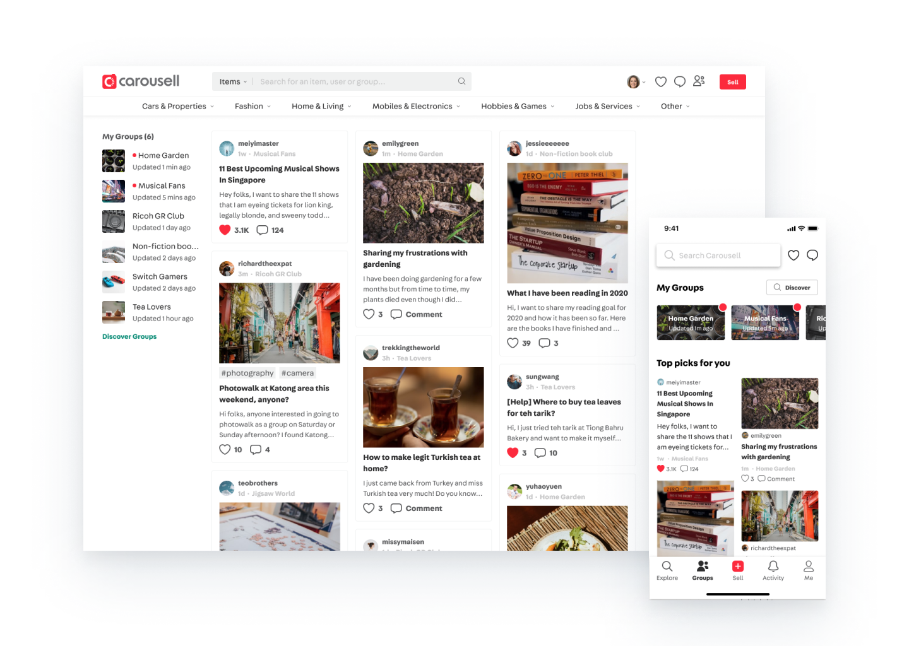

Carousell has thousands of Groups, each Group is a community of specific interest. In Groups, people with shared interest buy and sell from each other, and discuss topics related to their interest. To improve members' engagement in Groups, my team (then Community Experience team) built a personalized feed for members to discover Discussions and Marketplace listings. After launching the personalized feed, members' engagement on Group content increased by 40%.

# Background

Carousell is the largest and fastest growing consumer-to-consumer marketplace in South East Asia. As of Sep 2019, 70 million transactions happened on the online marketplace, buying and selling every day objects, such as clothes, electronic gadgets, furnitures, as well as properties, cars, and so on.

In 2016, Carousell launched Groups, where users form thousands of sub-community of specific interest within Carousell community to buy and sell with one another.

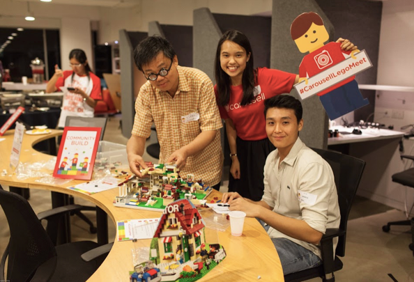

Lego Group meetup

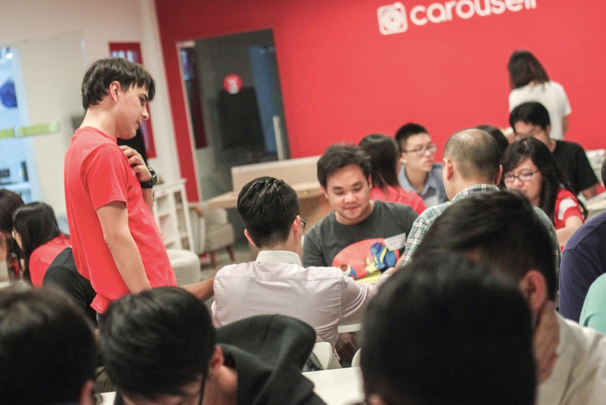

Board game Group meetup

Panini Collectors Group meetup

In 2018, Carousell wanted to improve retention to defend our market leader position in Singapore and Hong Kong. Besides working on getting more people to use Carousell, we wanted to focus on retaining users to ensure growth. As we believed a strong community of people of share interests will help build strong loyalty for Carousell, and therefore retain users on the platform, my team shifted focus from New Seller Success to Community Experience.

After discussing with business leaders and conducting exploratory user research in Singapore and Hong Kong, we defined our team mission to be "Facilitate meaningful interactions among Carousell users". To respond to the members' need to talk about their interest, we decided to build Groups Discussions as our first attempt to work toward the mission.

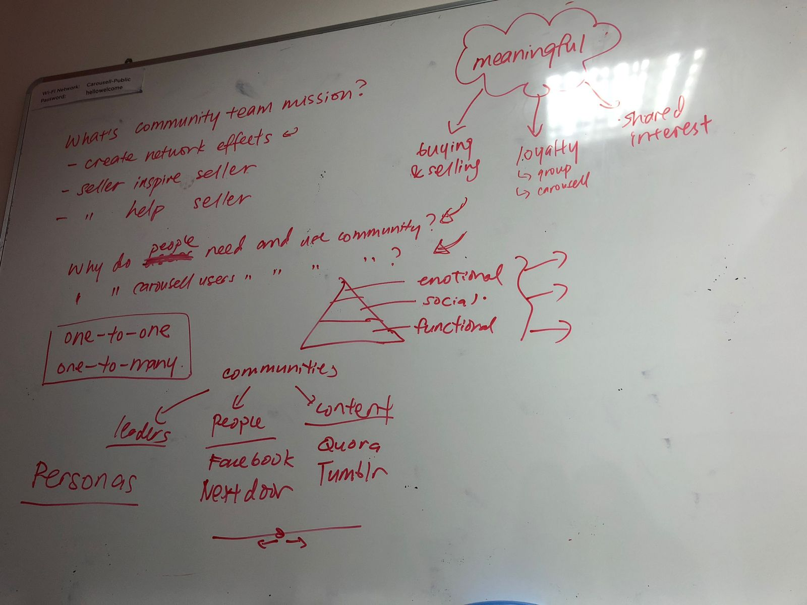

Discussion of team mission

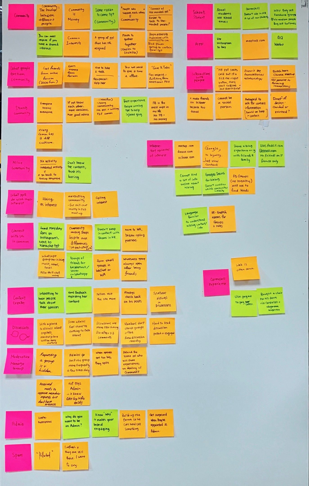

Insights from user research

> “It will be 2 times happier when talking to people with shared interest.” - Carousell user

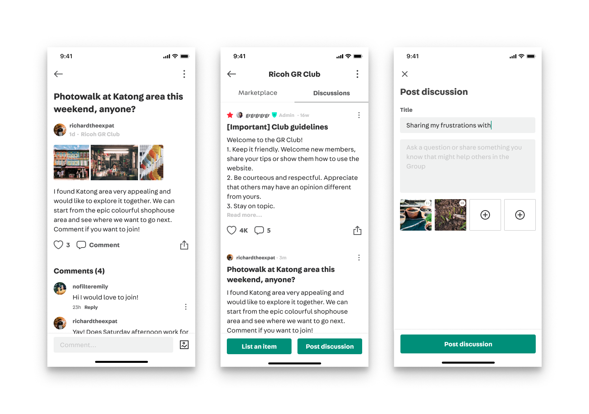

Group Discussions launched in May 2018.

After the launch, we saw retention increased significantly. However, after a few months, we observed that Group members became less engaged in Discussions posts. As a result, content creators are less motivated to create new content. This is a critical problem for building strong communities and for members to have meaningful interactions. We want to find out why that is and what we can do about it.

# **Business goal**

Improve engagement on community generated content, targeting people who are in at least one Group

# **Problem**

We observed that Groups members became less engaged in the discussions. As a result, content creators are less motivated to create new content.

Initially, we thought that this happened because members are not interested in the content in their Groups. When we were planning the go-to-market strategy for launching Group Discussions, we identified that quality content in early days of Group Discussions is critical to encourage engagement and create content. Therefore, we worked with community teams in different countries to seed content so we could launch with content in Groups. We assumed that quality of the content became lower when our teams did not encourage content creation and moderate the content.

Problem Hypothesis

**Members are not interested in the content in Groups.**

# Research

We talked to a few users who are active in Groups but didn't engage on the Discussions in the Groups. We mainly wanted to see how they use Groups and get to know what content interest them and how they find the content in Carousell app and website.

After research, we found that members are interested in the Discussions in their Groups. However, it is difficult to discover those interesting content in each Group. Sometimes they don't realize those interesting discussions are happening in their Groups.

In one of the interviews, when I asked one of the user to show me what she usually does in her Groups, she tapped into her Group and her attention faded out from our conversation. She started reading one of the discussion thread in her Group and asked us

> "Wait... I was looking for tips like this the other day."

She was trying to find information like that on Google and other communities but did not realize this discussion thread happened in her Carousell Group.

Another user told us that it's difficult for her to find out latest updates in her Groups.

> "I can't easily find out what's new in the Groups."

A user who are in many Groups said **_"I haven't check out my LEGO Group for a while... let me see..."_** when we asked him about the type of content that interests him in his LEGO Group.

From these conversations with members in Groups, we realized the bigger problem that prevents members to interact with discussions in their Groups is discover those discussion threads that they are interested in. Therefore, we refined the problem hypothesis to be the following.

Refined Problem Hypothesis

**It's difficult for the members to discover content that interest them.**

It's worth noting that the discovery problem surfaced a few months later because we leveraged notifications and activity feed to boost adoption during launch as part of our go-to-market strategy.

# Problems with content discovery

From talking to users, we discovered a few problems in our applications and websites that prevent users from discovering content that might interest them.

### Problem 1: **Groups Home was built for discovering Groups, not for discovering content in Groups.**

Group Home was the entry to Groups and content in Groups. It was built when Groups were launched in 2016 and hasn't been iterated since then. The page was optimized to communicate the concept of Groups and show Groups users might be interested in.

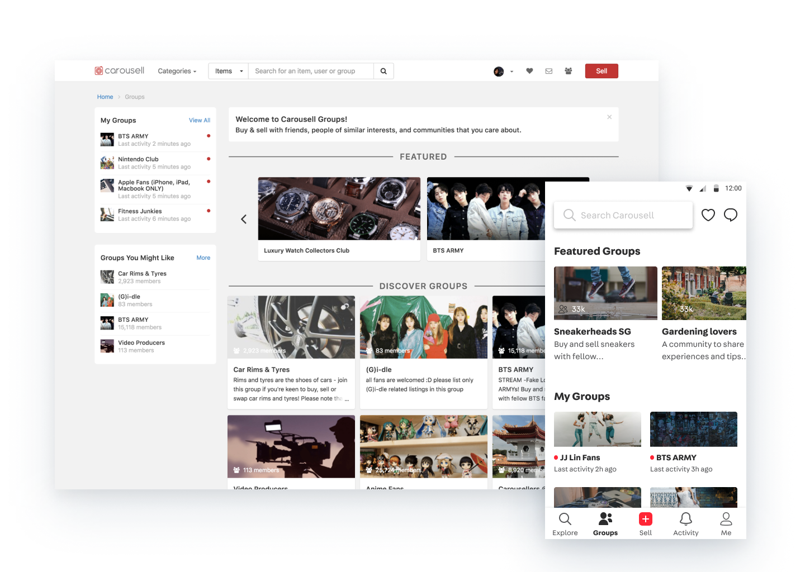

Groups Home Page on Carousell Web (Left) and Groups Home Tab on Carousell mobile applications (Right)

**It takes too much effort to check out what's new in the Groups.**

> "I can't easily find out what's new in the Groups."

To check out latest updates in Groups, one has to launch Carousell app, switch to the second tab, Groups Tab, and go in to each Group to check out latest updates in the Group. Groups Tab was designed to get more people to join Groups they might be interested in. Once you land on the tab, you first see featured Groups that might or might not interest you, and scroll down to see Groups they are member of. You see up to four of your Groups and tap into each Group to see more.

For people who already found their communities, this Group tab is one more click away for them to interact with their friends and items that members put on sale.

It's especially difficult to go back to each Group when the user is in more Groups. Only 4 Groups are displayed up front in Group Home. Users have to tap once more to reveal all their Groups if they are in more than 4 Groups.

**It's difficult for member to get updates on posts they interacted with previously.**

> "How do I know if the previous posts I interacted with had new comments?"

When we launched Groups Discussions, we decided not to notify users whenever there are new comments on posts they interacted with previously because it could be overwhelming and decrease users' attention on other more important notifications. Therefore, users have to find out new comments by going into Groups and scroll through updates on posts. This is not ideal as users could easily miss out comments and other updates they are interested in.

**Recommended Groups are not relevant, therefore it does not help users explore Groups they might be interested in.**

> "These (featured Groups) are not relevant to me."

For people who are new to communities on Carousell, our featured Groups are rarely relevant and it was difficult for them to think of exact search keyword to find the community they like unless they are very sure what they want.

## Problem 2: Content in Groups are split to marketplace and discussions, making browsing content in Groups more intentional.

When I designed for Group Discussions, I used tab structures to split Marketplace and Discussions in a single Group so users can come in to find what they are looking for. However, this makes going into each tab a conscious decision while browsing Groups. Over time, people stopped switching to different tabs unless they have clear purpose when coming into the Group.

As a result, members missed out interesting content in their Groups even when they check their Groups a few times in a week.

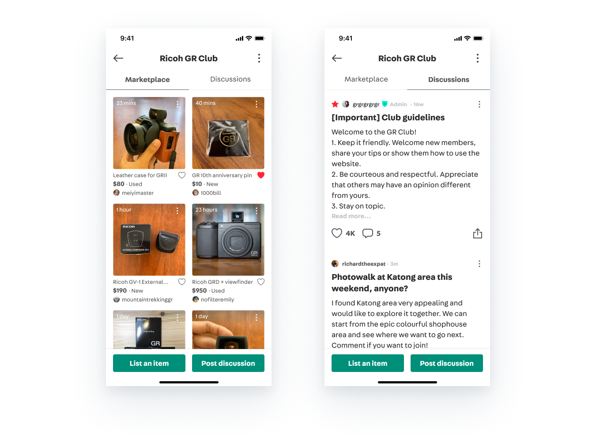

Tab Navigation to switch between Marketplace and Discussions in a Group.

We then conducted a shorter version of design sprint with the team. My Product Manager and I presented the findings from user interview and we landed on the problem we should be focusing on.

# Solutions

In the design sprint, we brainstormed solutions to solve the discovery problem with the prompt of HMW statement.

> **How Might We help members discover interesting content from their Groups?**

The team came up with a few ideas. One idea that got many of us excited was to redesign the Groups Home page to surface a personalized feed of content from Groups people are member of, for-sale items and conversations combined.

- We want to show discussions and listings from the user's Groups. Blended, and ranked by affinity.
- We want to help users to explore as much content as possible. Provide just enough information about a piece of content so users can decide whether to see more.

After the design sprint, I worked on wireframes that help us visualize different approaches to surface Groups content. We ended up with the following two approaches: List layout and Masonry layout.

In the team, we had very intense debate on whether list format or masonry format is better. For people who believe that list format works better, they want to focus and read on the content and only when they do, they feel they can invest more time to see details of the conversation. For the other group of people who believe that masonry format works better, they feel it’s important for them to see images and most of the time images tell them a lot and they will just click into it.

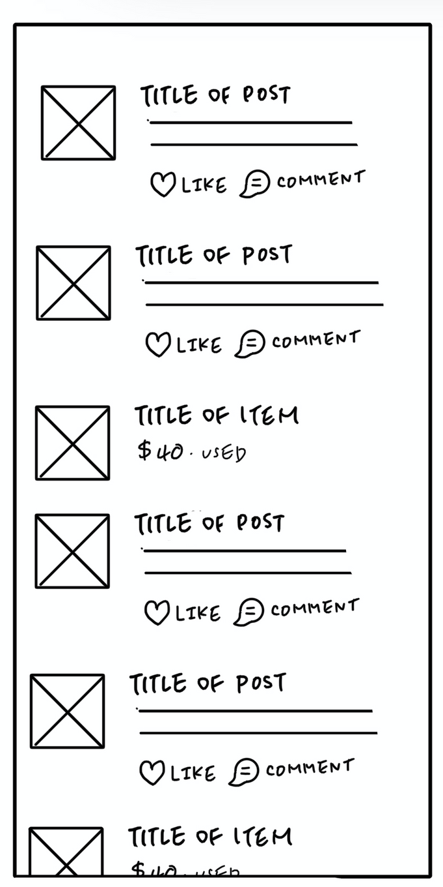

**List layout**

- (+) Better for text readability
- (+) Display more content given the same real estate
- (-) Distorted or limited image display

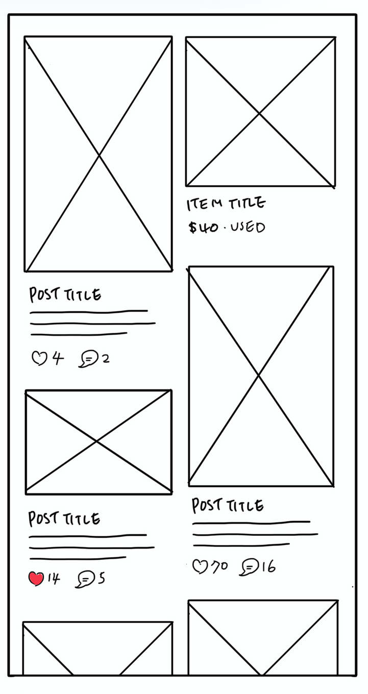

**Masonry layout**

- (+) Better for image scanning
- (-) Scalable to include different types of content (e.g. Groups)
- (+) Encourage casual browsing

I did framer prototypes for both and tested with a few internal users who had no idea what we were doing. We got a split of results as well, with a bit more on the masonry side. I saw that people tend to see more when they browse in a more casual mode, which is what masonry layout does to them. However, even with the same person, they might prefer different layouts for different use cases or content.

It seems like both layout works. We can only find out which layout drives better engagement when we build both and put different versions into users' hands. However, we agreed to pick one of the design to go with and validate our problem hypothesis first. Once we validated the problem, potentially we can build both versions and let users witch between them as they see fit.

We reviewed the content we have in Groups.

- In most Groups, we have more casual discussion thread rather than long and serious debates and information, such as people asking for advice or information, or people who share what they saw and just heard. From time to time, there are serious discussions like those on reddit.
- Images are most important factors to decide whether to check out a marketplace listing. and what the community members want to do in Groups.

We also got inspired by what Group members do in the community and would like to facilitate more casual and light-hearted browsing in Groups.

> "I scroll through the new things in my Groups because I enjoy seeing things I like." — BTS Group member

To her, it doesn't really matter whether it's discussions or marketplace listings, she just enjoys seeing pretty things related to her interest.

We decided to go with masonry layout in order help users discover content that might interest them after we evaluate the content we have in our community.

# Final design

## Experiment

The A/B experiment results was very impressive. Those who are exposed to the new Group Home Feed are much more engaged in their Groups compared to those who are on the old Group Tab.

We then rolled out the feature to everyone in Singapore, Philippines, and Hong Kong where our community are strong. We see an **improved engagement of community users by 40%** with personalised groups feed

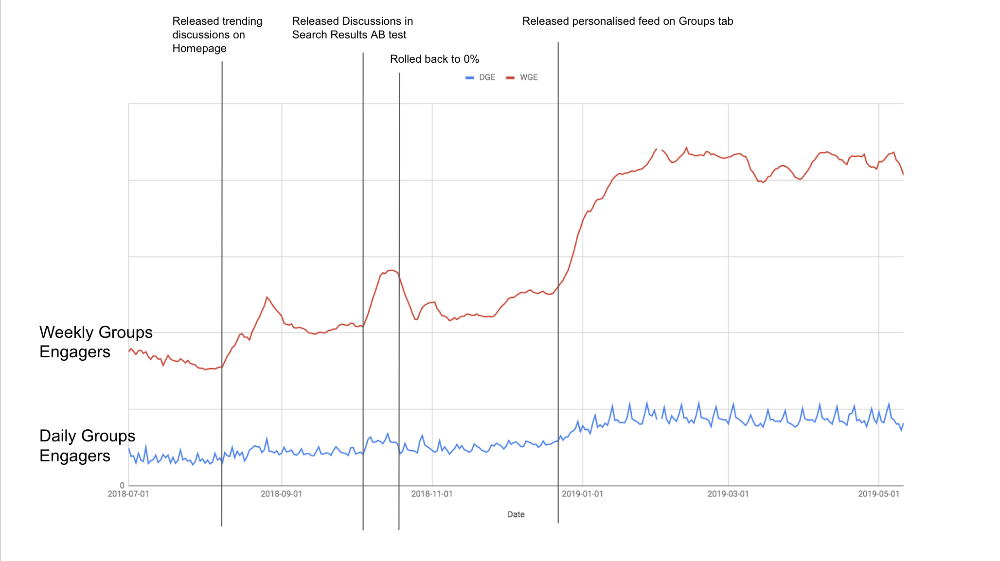

# Next steps

After launching Personalized Group Home Feed, we want to

- Experiment with different personalization model to optimize personalization.
- Include other types of content in the feed.
- Solve discover problem 2: improving discovery in Single Group Page.

Thank you for reading. I welcome feedbacks and discussions. Feel free to reach out to me at ritayutingwang@gmail.com or connect on [LinkedIn](https://www.linkedin.com/in/ritayutingwang/).

[Back to home](https://www.notion.so/Hello-I-m-Rita-Wang-7fa0c3d7665c473b8a6bc9aff33e5c7b) / [Resume](https://www.notion.so/Resume-b11400ee9195425ca882d6746d2122aa) / [About me](https://www.notion.so/About-me-05d9ba44e4264328afaf41a31f5ce48b)

Carousell is the largest and fastest growing consumer-to-consumer marketplace in South East Asia. As of Sep 2019, 70 million transactions happened on the online marketplace, buying and selling every day objects, such as clothes, electronic gadgets, furnitures, as well as properties, cars, and so on.
