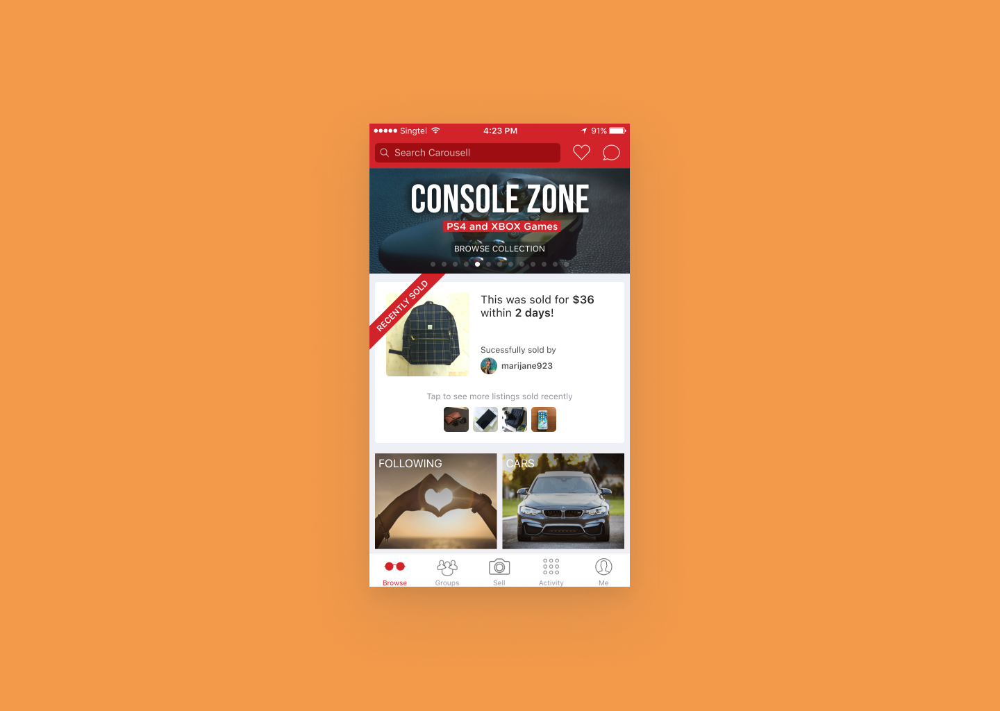

# Case study: Recently sold listings (7 minutes read)

Getting people ready to sell their first item on Carousell

# Background

Carousell is the largest and fastest growing consumer-to-consumer marketplace in South East Asia. As of Sep 2019, 70 million transactions happened on the online marketplace, buying and selling every day objects, such as clothes, electronic gadgets, furnitures, as well as properties, cars, and so on.

In early 2017, we observed people who came to Carousell with intent to sell something, and found that **the conversion of sign-up to list first item up for sale was much lower** in growth markets (Malaysia, Indonesia, Taiwan) compared to our dominant market Singapore.

At Carousell, we believe that sellers experience their magic moments when they successfully sell their first item on Carousell. Without listing an item up for sale, one would never experience the value Carousell has to offer, and therefore is less likely to stay on the platform or introduce the platform to friends and family. As we are trying to expand in South East Asia, improving the initial experience and utilise our marketing budget in each market is important.

As Growth team, we started to look into the seller's initial journey and see what we can do to help them list their first items up for sale. With higher conversion rate for every sign-ups to a meaningful action, i.e. to list an item in the case of sellers, each marketing dollar is better utilised.

Note: Buyers come to Carousell for the good price of second hand items and the uniqueness and timelessness. As long as there are good deals and reasonable ways to transact, buyers will come to the marketplace.

# Problem

To understand why people don't list items up for sale despite having sell intent, my Product Manager and I travelled to Malaysia and Indonesia to talk to people who joined Carousell with an intent to sell.

People who want to start selling are of diverse reasons. Usually it starts with them realising they have things they no longer need or want during annual cleanup or moving to a new place, moving on from a life stage, moving on from a hobby, or simply want to let fo of things that no longer help express themselves.

My product manager and I travelled to Malaysia and Indonesia, with the help of our team on the ground, we talked to new users who recently downloaded Carousell app and sign up for accounts. We selected participants who came to Carousell with sell intent based on their answers in screening questions. We talked to both people who end up listing an item and people who did not.

Despite some usability issues brought up by a few people, most of the people we talked to shown hesitation to start listing items up for sale. Below is a list of insights we gathered.

They might told us that they don't have time or they would do it later in one shot in the beginning. However, after digging deeper, we found a crucial doubt they had.

> "I am not sure Carousell can help me sell XYZ."

This is a doubt towards Carousell as a marketplace, whether Carousell has enough buyers and demand. Most people have not listed an item because they are not sure if they can make the sale after they put in the effort to list the item.)

> "I am not sure I can sell something online."

This is a doubt towards themselves, whether they are capable to sell something online. Selling an used item online to a stranger was new to many people back then in these growth markets.

From our interviews with people who did list something on Carousell, we found that most of them (1) have previous online selling experience on auction websites or through classifieds on newspaper or (2) have friends who are vocal with their successful transactions and the money earned on Carousell. One person said that "If my friend can do it (selling successfully on Carousell), I think I can do it too."

We considered these as ways they overcome the doubts and decide to give it a try and list items up for sale on Carousell.

After discussing with the team in a shorter version of design sprint, we reframed the problem,

> People in Growth markets are less confident that they can sell their pre-loved items on Carousell.

This is more pronounced in growth markets due to

- Perceived small user base
- Perceived low liquidity
- Unfamiliar with second-hand transaction

# Ideas

> How might we help people with sell intent feel more confident to sell on Carousell so they are ready to list their first item?

In the design sprint, we voted these 4 ideas to be further explored and discussed out of all the ideas we came up with. We discussed the impact with product manager, data analyst, and relevant business teams, and discussed the effort and limitations with engineers.

**Idea A**

A feature that people can **use phone camera to scan their room and instantly know how much each item is worth** and auto-fill details to list it on Carousell.

_Impact: High / Effort: Difficult_

**Idea B**

**Show friends' successful transactions to people who have sell intent,** associated users by Facebook friendship, only available if they connect their facebook account.

_Impact: Low / Effort: Medium_

Social proof is powerful but only available to small group of people. Some users showed hesitation letting their friends know what they are selling.

**Idea C**

**Show recently sold items on Homepage / Category page / Search page**

_Impact: Medium / Effort: Easy_

From research, we found that people with intent to sell check out the marketplace for examples to see how other users are selling, and gauge the supply and demand of the item they have in mind.

**Idea D**

**A Campaign webpage where people get to know how much their pre-loved items worth** and direct them to list the items.

_Impact: Medium / Effort: Medium_

Good for marketing and getting people to sign up.

---

### Prioritising the ideas

Considering the impact and effort required, we decided to go with idea C to validate the problem hypothesis.

Idea C: **Show recently sold items on Carousell on Homepage / Category page / Search page**

# Iterating on the idea

We decided to **Show recently sold items on Carousell on Homepage / Category page / Search page** to \*\*\*\*help people with sell intent feel more confident to sell on Carousell so they are ready to list their first item. With the wireframes discussed with the team, we wanted to get some feedbacks from real users before we put more efforts into it.

I showed the wireframe to a few users trying getting their thoughts on the idea.

### Homepage

On Homepage, we show items that are recently sold, and with high liquidity (sold in short time). We want to show time taken to sell the item and the price of the item to help people visualise the effort required and how much they can earn if they just list a similar item.

**User testing insights**

In user testing session, some showed doubts on the authenticity of these recently sold items. They think if they see it, they might not believe those transactions actually happen. They were curious who the sellers are and they want to see more details of the item.

**Iterated: Include sellers' profiles to show authenticity**

### Browse / Search experience

Previously, we only showed active listings on the marketplace because we thought it doesn't make sense to show buyers things they could not buy and jeopardise the active listings they can buy.

For potential sellers, sold listings allow them to gauge the demand and liquidity. Therefore, we show sold items as part of the experience when people try to browse items in the same category or try to search for specific items.

**User testing insights**

In user testing session, we observed people with sell intent scrolling through marketplace to see sold items for a while and get lost in the listings and forgot to list their own item. Therefore, we think it could be beneficial to include a call to action to nudge people to list an item up for sale after they saw many similar items sold.

**Tech limitation**

We wanted to show sold listings as a section so this does not mix up with the active listings. However, due to technical constraint to insert a section in search results, we compromised to show sold listings among the active listings with an indicator that the item is sold.

Following the then design system Carousell had back then, I iterated based on user testing insights and tech limitation, these are the final mocks handed to engineers. The team spent two weeks time to develop and test the feature and we started experimenting with users in Growth Markets.

.png>)

# Experiment

This solution targets people with intent to sell. In an ideal world, we should have a way to find out new members' intent on Carousell. However, back then the most accurate proxy we had is whether people come to Carousell from a sell-side campaign or buy-side campaign. It's a proxy for identifying their intent.

In this experiment, we consider people who come to Carousell from a campaign with sell angle copy (e.g. "Declutter your house and earn extra cash") as new users with sell intent, and we consider people who come to Carousell from a campaign with buy angle copy (e.g. "Buy latest gadgets at affordable price") as new users with buy intent.

For people who come to Carousell organically, it's difficult for us to assume their intent based on their initial behavior in the app.

After running the experiment for more than two weeks, we reached statistically significant and declared the experiment as a success.

A/B Test results showed that among people with sell intent, those who are exposed to recently sold listings are **15% - 54% more likely to list their first item up for sale**. They are more convinced and ready to start selling, to experience the same thing as what others did.

We also exposed the recently sold listings to a small portion of people with buy intent and found that this affects their buying experience negatively.

# Follow-up

**Confirm the intent (sell or buy)**

Since the assumption is validated and the solution worked, we want to include this as part of the onboarding experience for people with sell intent, either from paid or organic traffic, to get more people ready to list their first item.

Also, this experience is not relevant for people who are only interested in buying, validated with people from buy side campaign.

We figured the best way to understand people's intent is to ask them directly.

👉 After people sign up on Carousell, we ask them whether they are here to buy or sell, and provide relevant onboarding experience for them.

This became a tipping point for Carousell's onboarding experience. We began providing relevant onboarding experience according to people's intent, whether they are here to buy or sell.

The same team continued working on improving new seller's journey. In 3 quarter time, we **increased install -> first sale conversion by > 2x.**

Carousell also set up Buyer Experience team. With **personalised onboarding flow based on shopping interest,** we could provide buyers personalisations in their initial experiences and improve it with analysis on people's browsing behavior further on.

Thank you for reading. I welcome feedbacks and discussions. Feel free to reach out to me at ritayutingwang@gmail.com or connect on [LinkedIn](https://www.linkedin.com/in/ritayutingwang/).

[Back to home](https://www.notion.so/Hello-I-m-Rita-Wang-7fa0c3d7665c473b8a6bc9aff33e5c7b) / [Resume](https://www.notion.so/Resume-b11400ee9195425ca882d6746d2122aa) / [About me](https://www.notion.so/About-me-05d9ba44e4264328afaf41a31f5ce48b)
